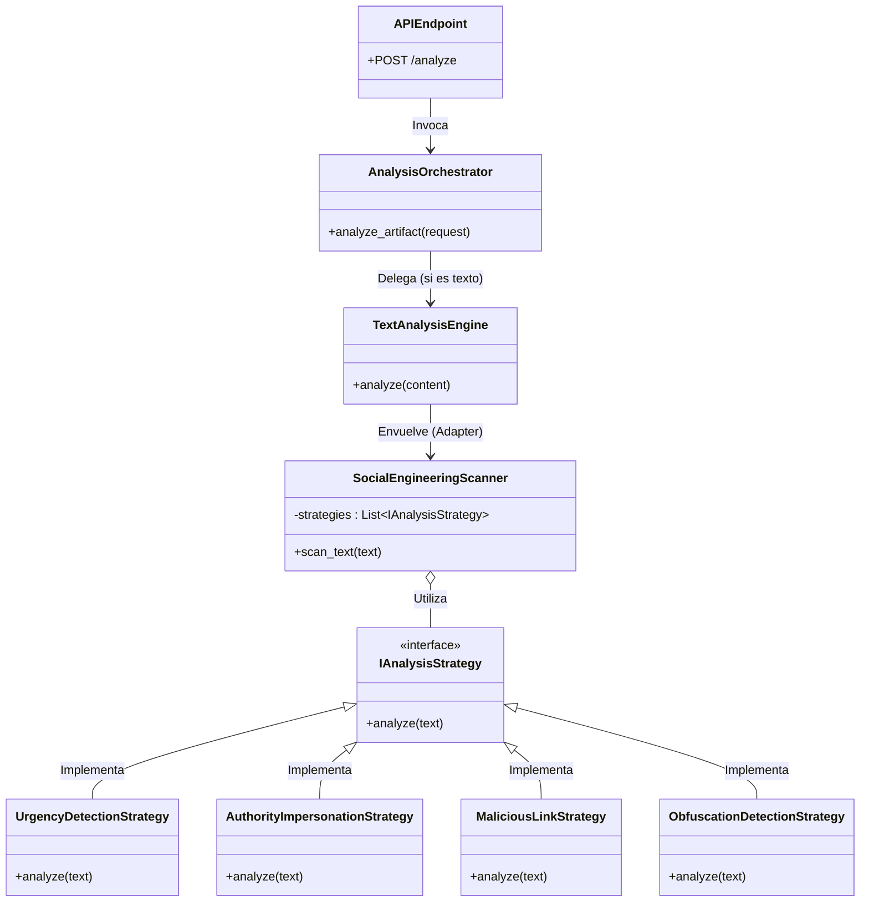

# Social Engineering Detector

> **Una capa de defensa inteligente contra ataques de Ingeniería Social.**

## Licencias

[](https://www.python.org/downloads/)
[](https://fastapi.tiangolo.com)
[](https://www.docker.com/)
[](tests/)
[](LICENSE)

## 📋 Descripción General

**Social Engineering Detector** es una API de ciberseguridad avanzada diseñada para operar como una **capa de defensa proactiva** ante amenazas de Ingeniería Social.

Su objetivo principal es **proteger al usuario final** analizando artefactos digitales (como URLs, correos electrónicos o mensajes SMS) en tiempo real para identificar intentos de manipulación, fraude o Phishing antes de que ocurra una interacción peligrosa.

Este proyecto ha sido construido bajo los principios de **Arquitectura Limpia (Clean Architecture)** y el **Ciclo de Desarrollo de Software Seguro (SSDLC)**, lo que garantiza no solo una detección eficaz, sino también un sistema mantenible, escalable y auditable.

### ¿Para qué sirve?

- **Detección Temprana:** Identifica enlaces sospechosos o maliciosos basándose en heurísticas avanzadas y patrones de ataque conocidos.
- **Análisis Automatizado:** Procesa grandes volúmenes de solicitudes sin intervención humana gracias a su arquitectura asíncrona.
- **Integración de Seguridad:** Sirve como backend de análisis para clientes de correo, navegadores o sistemas SIEM corporativos.

---

## 🚀 Características Clave (Novedades)

- **Arquitectura Limpia:** Estricta separación de responsabilidades que facilita la evolución del software sin deuda técnica.
- **Rendimiento Asíncrono:** Migración completa a `httpx` y `async/await` para evitar bloqueos bajo alta concurrencia.
- **Observabilidad Completa:** Sistema de **Logging Estructurado** (vía `loguru`) que permite auditoría forense y depuración en producción.
- **Alta Calidad (Testing):** Suite de pruebas automatizadas (Unitarias e Integración) con `pytest` para garantizar la estabilidad del código.
- **Seguridad por Diseño:** Middleware de seguridad configurado y manejo responsable de secretos.
- **Patrón Strategy:** Motor de análisis extensible. Agregar soporte para nuevos tipos de amenazas es tan simple como implementar una nueva "Estrategia".
- **Docker Ready:** Listo para despliegue contenerizado seguro.

### ✨ Últimos Cambios Implementados

Hemos realizado actualizaciones críticas para mejorar la robustez y facilidad de uso:

1.  **Integración de Análisis de Texto Avanzado:** Se ha conectado el motor de análisis de texto (Strategy Pattern) con la API principal. Ahora el endpoint `/analyze` soporta `artifact_type: "TEXT"` y utiliza análisis semántico difuso (_Fuzzy Matching_) en lugar de simples expresiones regulares.
2.  **Gestión de Dependencias:** Corrección de problemas de compatibilidad en Windows/Python 3.12+ ajustando versiones de `pydantic`.
3.  **Licenciamiento:** Adición del archivo `LICENSE` (MIT) para claridad legal.
4.  **Anti-Ofuscación:** Nueva estrategia `ObfuscationDetectionStrategy` capaz de detectar intentos de evasión en el texto (caracteres invisibles, homoglifos, espaciado irregular).
5.  **Testing Reforzado:** Nuevas pruebas de integración para validar la detección de urgencia semántica y tácticas de ofuscación.

### 🛡️ Mejoras Recientes (Security & Architecture Hardening)

- **Gestión de Secretos:** Implementación de `SecretStr` para manejo seguro de credenciales. Las API Keys ya no están hardcoded.
- **CORS Estricto:** Configuración robusta de CORS validando orígenes permitidos mediante `BACKEND_CORS_ORIGINS`.
- **Inyección de Dependencias:** Refactorización del Orquestador para un acoplamiento débil, facilitando pruebas y mantenibilidad.
- **Dependencias Pinneadas:** `requirements.txt` con versiones fijas para garantizar construcciones reproducibles y seguras.
- **Validación Estricta:** Schemas de Pydantic reforzados para sanitización de entradas.

---

## 🏗️ Arquitectura del Sistema

El sistema actúa como un **orquestador inteligente** que recibe artefactos y delega el análisis al motor más apropiado.

Graph TD:
`Cliente -> API (FastAPI) -> Orquestador -> Motores de Análisis -> Resultado`

### 📐 Patrones de Diseño Utilizados

El sistema actúa como un **orquestador inteligente** que recibe artefactos y delega el análisis al motor más apropiado. A continuación se presenta un diagrama UML de clases que ilustra la jerarquía del proyecto y el modelo subyacente de sus motores.



---

## 🛠️ Estructura del Proyecto

```text
social_eng_detector/
├── src/
│   ├── api/                 # Endpoints y Rutas
│   ├── core/                # Configuración y Logging
│   ├── domain/              # Modelos (Schemas)
│   ├── services/            # Lógica de Negocio (Orquestador y Motores)
│   └── main.py              # Punto de entrada de la aplicación
├── tests/                   # Suite de Pruebas Automatizadas
├── Dockerfile               # Configuración de Contenedor
├── requirements.txt         # Dependencias Modernas (httpx, loguru, fastapi)
└── README.md                # Documentación del Proyecto
```

---

## 💻 Instalación y Uso

### Prerrequisitos

- Python 3.11+
- Docker (Opcional)

### Ejecución Local

1.  **Clonar el repositorio:**

    ```bash
    git clone https://github.com/George230297/SocialEngineDetector.git
    cd social_eng_detector
    ```

2.  **Configurar entorno virtual:**

    ```bash
    python -m venv .venv
    # Windows
    .venv\Scripts\activate
    # Linux/Mac
    source .venv/bin/activate
    ```

3.  **Instalar dependencias:**

    ```bash
    pip install -r requirements.txt
    ```

4.  **Configurar variables de entorno:**
    Crea un archivo `.env` en la raíz (puedes copiar el ejemplo):

    ```ini
    PROJECT_NAME=social-eng-detector
    API_VERSION=v1
    VIRUSTOTAL_API_KEY=tu_api_key
    OPENAI_API_KEY=tu_api_key
    BACKEND_CORS_ORIGINS=["http://localhost:3000"]
    ```

5.  **Ejecutar pruebas (Opcional pero recomendado):**

    ```bash
    python -m pytest
    ```

6.  **Iniciar el servidor:**

    ```bash
    python src/main.py
    ```

    El servidor iniciará en `http://localhost:8000`. Documentación interactiva en `http://localhost:8000/docs`.

7.  **Ejecutar Pruebas (Nuevo):**
    Para verificar que todo funciona correctamente:
    ```bash
    pytest
    ```

### Docker (Recomendado)

```bash
docker build -t SocialEngineDetector 
docker run -p 8000:8000 SocialEngineDetector
```

---

## 📡 Uso de la API

**POST** `/api/v1/scan/analyze`

**Request:**

```json
{
  "artifact_type": "URL",
  "content": "http://paypal-secure-update.com.login.php"
}
```

**Response:**

```json
{
  "risk_score": 85,
  "risk_level": "MALICIOUS",
  "findings": [
    "Longitud de URL sospechosa",
    "Palabras clave sensibles detectadas"
  ]
}
```

---

## 💻 Comandos de Prueba

Puedes probar la API directamente desde tu terminal.

**Opción 1: cURL (Linux/Mac/Git Bash)**

```bash
curl -X 'POST' \
  'http://localhost:8000/api/v1/scan/analyze' \
  -H 'accept: application/json' \
  -H 'Content-Type: application/json' \
  -d '{
  "artifact_type": "URL",
  "content": "http://paypal-secure-update.com.login.php"
}'
```

**Opción 2: PowerShell (Windows)**

```powershell
$body = @{
    artifact_type = "URL"
    content = "http://paypal-secure-update.com.login.php"
} | ConvertTo-Json

Invoke-RestMethod -Uri "http://localhost:8000/api/v1/scan/analyze" `
    -Method Post `
    -ContentType "application/json" `
    -Body $body
```

---

## 🔮 Roadmap

- [x] **Fase 1:** Análisis Heurístico de URLs y Arquitectura Base.
- [x] **Fase 1.5:** Hardening (Testing, Logging, Async performance).
- [x] **Fase 2:** Análisis de Texto Natural (NLP) usando **Patrón Strategy** para detección de ingeniería social.
- [ ] **Fase 3:** Integración con Threat Intelligence (VirusTotal).

---

## 🧠 Nueva Funcionalidad: Motor de Detección de Texto (Strategy Pattern)

Hemos implementado un sistema flexible basado en el **Patrón de Diseño Strategy** para analizar intentos de manipulación psicológica en textos.

### Estrategias Incluidas:

1.  **🚨 UrgencyDetectionStrategy:** Detecta lenguaje de urgencia o miedo. Utiliza **Análisis Semántico Difuso** (Fuzzy Matching) para resistir errores ortográficos o intentos básicos de ofuscación (ej. "urg3nte").
2.  **👔 AuthorityImpersonationStrategy:** Identifica intentos de suplantación de identidad de altos cargos (CEO, RRHH, TI) combinados con exigencias. También impulsado por Fuzzy Matching.
3.  **🔗 MaliciousLinkStrategy:** Extrae y analiza URLs en el texto, detectando anomalías, ofuscación y estructuras sospechosas.
4.  **🛡️ ObfuscationDetectionStrategy:** (Nueva) Estrategia defensiva que clasifica el texto basándose puramente en anomalías estructurales (uso de caracteres de ancho cero, mezcla de alfabetos cirílicos/latinos, espaciado anómalo).

### Ejemplo de Uso (Python):

```python
from src.services.analysis_engines.text_analysis import (
    SocialEngineeringScanner, UrgencyDetectionStrategy,
    AuthorityImpersonationStrategy, MaliciousLinkStrategy
)

# 1. Definir estrategias a usar
strategies = [
    UrgencyDetectionStrategy(),
    AuthorityImpersonationStrategy(),
    MaliciousLinkStrategy()
]

# 2. Inicializar el escáner
scanner = SocialEngineeringScanner(strategies)

# 3. Analizar texto sospechoso
result = scanner.scan_text("URGENTE: Soy el CEO, transfiere fondos a http://banco-falso.com")

print(f"Riesgo: {result['risk_level']}") # CRITICAL
```

### ✅ Robustez y Testing

El módulo cuenta con una suite de pruebas exhaustiva (`tests/test_text_analysis.py`) que verifica:

- **Entradas vacías o nulas:** Manejo seguro sin errores.
- **Falsos positivos:** Uso de límites de palabras (Regex boundaries) para evitar coincidencias parciales (ej. "insurgente" ≠ "urgente").
- **Acumulación de riesgo:** Puntuación dinámica basada en múltiples factores.

---

## ⚠️ Aviso Legal

**Social Engineering Detector** es una herramienta educativa y defensiva.  
Su uso para atacar sistemas sin consentimiento es ilegal. Los desarrolladores no se hacen responsables del mal uso de este software.

---

## 👨‍💻 Autor

Desarrollado con ❤️ para una internet más segura.
